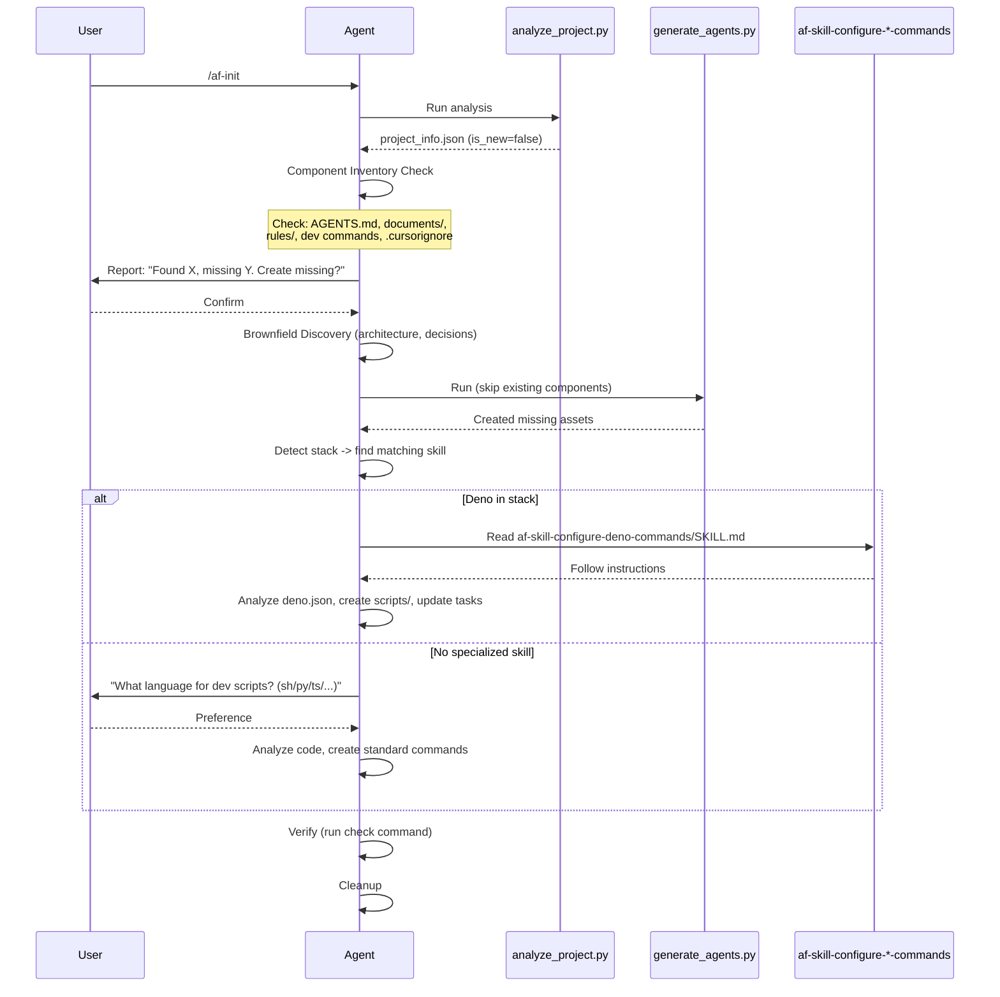

# af-init: Dev Commands Creation + Brownfield Idempotency

## Goal

Enable `af-init` to create real development command scripts (not just text references) and make brownfield initialization idempotent by checking each component before creation. This reduces manual setup after init and prevents overwriting existing user work.

## Overview

### Context

`af-init` initializes project agent documentation (AGENTS.md, documents/, rules). Two gaps exist:

1. **Dev commands are text-only**: `generate_agents.py` writes strings like `deno task start` into AGENTS.md template but never creates actual script files (`scripts/check.ts`, etc.). The separate `af-skill-configure-deno-commands` skill exists but is Deno-specific and not integrated into init flow.

2. **Brownfield overwrites blindly**: The brownfield workflow doesn't verify which components already exist. AGENTS.md is always overwritten. No check for existing rules, dev command scripts, or partial `documents/` structure.

**Pain points:**
- After `af-init` on a brownfield project, user still must manually create dev command scripts
- Re-running `af-init` may destroy user's customized AGENTS.md
- No standard interface for non-Deno stacks (Node.js, Go, Python)

**Relevant files:**
- @catalog/skills/af-init/SKILL.md - main skill definition
- @catalog/skills/af-init/scripts/generate_agents.py - asset generation
- @catalog/skills/af-init/scripts/analyze_project.py - project analysis
- @catalog/skills/af-init/assets/AGENTS.template.md - AGENTS.md template
- @catalog/skills/af-skill-configure-deno-commands/SKILL.md - Deno-specific commands skill
- @benchmarks/af-init/scenarios/brownfield/mod.ts - brownfield benchmark
- @benchmarks/af-init/scenarios/greenfield/mod.ts - greenfield benchmark
- @documents/requirements.md - SRS (FR-1, FR-5 relevant)

### Current State

**af-init SKILL.md steps:**
1. Initialize (todo_write)
2. Analyze Project (analyze_project.py -> project_info.json)
3. Greenfield: Interview -> interview_data.json
4. Brownfield: Discovery -> interview_data.json
5. Generate Assets (generate_agents.py): AGENTS.md, documents/, .cursorignore, rules, configs
6. Cleanup & Verify

**Dev commands in generate_agents.py (lines 33-45):**
- Hardcoded per-stack strings: Deno -> `deno task start/check/test`, Node.js -> `npm start/test`, Go -> `go run/test`
- Only inserted as text in `{{DEVELOPMENT_COMMANDS}}` placeholder
- Greenfield: creates `deno.json`/`package.json` with stub tasks (lines 191-220)
- No script files created

**Brownfield checks (generate_agents.py):**
- `documents/` files: checked via `os.path.exists(path)` (line 147)
- `.cursorignore`: checked (line 154)
- AGENTS.md: **not checked**, always overwritten (line 121)
- Rules: **not checked**, always overwritten via `shutil.rmtree` + `copytree` (lines 103-105)

**Benchmarks:**
- `af-init-brownfield`: checks AGENTS.md, architecture, key_decisions, doc_rules, documents/. No dev commands checks.
- `af-init-greenfield`: checks interview, AGENTS.md, doc_rules. No dev commands checks.

### Constraints

- Skills in `catalog/` are the PRODUCT (stored in `.cursor/` for end users)
- Changes to skills MUST be tested through benchmarks
- `generate_agents.py` is a Python script run by the agent - it cannot invoke other skills
- Agent CAN invoke skills during SKILL.md step execution
- Must support multiple stacks: Deno, Node.js, Go, Python, Rust, Swift
- AGENTS.md template has `### Standard Interface` (fixed text) and `### Detected Commands` (dynamic)

## Definition of Done

- [ ] af-init creates real dev command scripts (not just text) during initialization
- [ ] Agent asks user about scripting language preference when creating dev commands
- [ ] Brownfield flow checks each component (AGENTS.md, documents/, rules, dev commands) before creation
- [ ] Existing components are preserved unless user explicitly confirms overwrite
- [ ] `af-skill-configure-deno-commands` enhanced for use from af-init
- [ ] Generic fallback implemented for non-Deno stacks
- [ ] Benchmarks updated: brownfield tests idempotency, both flows test dev commands creation
- [ ] `deno task check` passes

## Solution

Selected variant: **A - Delegation to specialized skills** with `af-skill-configure-deno-commands` + generic fallback.

### Sequence (Brownfield)



### Step-by-step implementation

#### Step 1. Modify `generate_agents.py` - add `--no-overwrite-agents` flag

**File:** `catalog/skills/af-init/scripts/generate_agents.py`

**Changes:**
- Add CLI flag `--no-overwrite-agents` (7th argument, optional)
- When flag is set: skip writing AGENTS.md if it already exists, print `"AGENTS.md exists, skipping (--no-overwrite-agents)"`
- Add similar flag for rules: `--no-overwrite-rules`
- When `--no-overwrite-rules` is set: skip `shutil.rmtree` + `copytree` if destination rule dir exists

**Why:** Python script needs to support selective generation. Agent decides what to skip based on component inventory, then passes appropriate flags.

**Verification:** `python3 generate_agents.py --help` shows new flags. Run twice on same directory - second run with flags should not overwrite.

#### Step 2. Add "Component Inventory" step to `af-init/SKILL.md`

**File:** `catalog/skills/af-init/SKILL.md`

**Changes:** Insert new step 4.5 (between Brownfield Discovery and Generate Assets):

```
4.5 **Component Inventory (Brownfield only)**
   - Check existence of each component:
     - `AGENTS.md` - exists?
     - `documents/` - exists? Which files inside?
     - `.cursor/rules/` - exists? Which rules?
     - `scripts/` or dev command config - exists?
     - `.cursorignore` - exists?
   - Report findings to user as a checklist:
     "[x] AGENTS.md - exists (will skip unless you want to regenerate)
      [ ] documents/requirements.md - missing (will create)
      [x] .cursor/rules/ - exists (will skip)
      [ ] scripts/ - missing (will create dev commands)"
   - Ask user: "Create missing components? Override existing? [create missing / override all / select]"
   - Based on user response, set flags for generate_agents.py
```

**Why:** Agent-level decision (not script-level) because it requires user interaction.

#### Step 3. Modify step 5 "Generate Assets" in `af-init/SKILL.md`

**File:** `catalog/skills/af-init/SKILL.md`

**Changes:** Step 5 gets conditional logic:

```
5. **Generate Assets & Scaffolding**
   - Determine flags based on Component Inventory:
     - If AGENTS.md exists and user chose "create missing": add `--no-overwrite-agents`
     - If rules exist and user chose "create missing": add `--no-overwrite-rules`
   - Run generation script with flags:
     python3 .cursor/skills/af-init/scripts/generate_agents.py \
       project_info.json interview_data.json \
       .cursor/skills/af-init/assets/AGENTS.template.md AGENTS.md \
       .cursor/skills/af-init/assets/rules .cursor/rules \
       [--no-overwrite-agents] [--no-overwrite-rules]
```

#### Step 4. Add new step 6 "Configure Development Commands" to `af-init/SKILL.md`

**File:** `catalog/skills/af-init/SKILL.md`

**Changes:** Insert new step after Generate Assets:

```
6. **Configure Development Commands**
   - Read `project_info.json` to get detected stack.
   - **Skill Lookup**: For each stack item, check if a specialized skill exists:
     - `Deno` -> Read and follow `.cursor/skills/af-skill-configure-deno-commands/SKILL.md`
     - Other stacks -> Use generic fallback (see below)
   - **Generic Fallback** (when no specialized skill exists):
     1. Ask user: "No specialized dev commands skill for [stack]. What language do you prefer for build scripts? (shell/python/the stack's language)"
     2. Analyze existing config files (package.json scripts, Makefile, Cargo.toml, etc.)
     3. Create standard command interface:
        - `check`: build + lint + fmt + test
        - `test <path>`: run single test
        - `dev`: watch mode
        - `prod`: production run
     4. Create script files in `scripts/` directory
     5. Update config file (package.json, Makefile, etc.) to reference scripts
   - **Skip condition**: If `scripts/` directory already exists with check/test commands and user chose "create missing" in Component Inventory -> skip this step.
   - **Verify**: Run the `check` command to ensure it works (may fail on empty project - that's OK for greenfield, log the result).
```

#### Step 5. Enhance `af-skill-configure-deno-commands/SKILL.md`

**File:** `catalog/skills/af-skill-configure-deno-commands/SKILL.md`

**Changes:**
- Add `## Context` section: explain this skill can be invoked standalone or from `af-init`
- Add `## Rules & Constraints` section:
  - Rule: Check existing `scripts/` and `deno.json` tasks before creating
  - Rule: Do not overwrite existing scripts unless user confirms
  - Rule: `check.ts` must implement the full Standard Interface checklist
- Expand `## Workflow` with details on what `check.ts` should contain:
  - Concrete implementation template for `scripts/check.ts`
  - Error handling and exit codes
- Add `## Verification` section: `deno task check` must pass

**Why:** Current SKILL.md is too minimal (50 lines). Agent needs more concrete instructions to create working scripts.

#### Step 6. Update `AGENTS.template.md` - `Detected Commands` section

**File:** `catalog/skills/af-init/assets/AGENTS.template.md`

**Changes:**
- `### Detected Commands` section: change `{{DEVELOPMENT_COMMANDS}}` to include note that commands were configured by specialized skill
- Add placeholder for script file paths

Current:
```
### Detected Commands
{{DEVELOPMENT_COMMANDS}}
```

New:
```
### Detected Commands
{{DEVELOPMENT_COMMANDS}}

### Command Scripts
{{COMMAND_SCRIPTS}}
```

**`generate_agents.py`** changes: add `{{COMMAND_SCRIPTS}}` placeholder support. Default value: `- No scripts configured`. Agent updates this after step 6 (Configure Development Commands).

#### Step 7. Update benchmarks

**File:** `benchmarks/af-init/scenarios/brownfield/mod.ts`

**Changes:**
- Add checklist items:
  ```typescript
  {
    id: "dev_commands_created",
    description: "Were development command scripts created (e.g., scripts/check.ts for Deno)?",
    critical: true,
  },
  {
    id: "deno_json_tasks_updated",
    description: "Does deno.json contain tasks pointing to scripts/ (check, test, dev)?",
    critical: true,
  },
  ```
- brownfield fixture `deno.json` already has incomplete tasks (only `test` and `check: "deno lint"`) - good for testing that skill adds missing commands

**File:** `benchmarks/af-init/scenarios/greenfield/mod.ts`

**Changes:**
- Add checklist item for dev commands:
  ```typescript
  {
    id: "dev_commands_configured",
    description: "Were development commands configured with real scripts (not just stub echo commands)?",
    critical: false, // Non-critical for greenfield since project may be empty
    type: "semantic" as const,
  },
  ```

**New file:** `benchmarks/af-init/scenarios/brownfield-idempotent/mod.ts`

**Purpose:** Test that running af-init twice doesn't overwrite existing files.

**Setup:**
- Pre-create AGENTS.md with custom content (e.g., "CUSTOM CONTENT MARKER")
- Pre-create documents/ with custom whiteboard.md
- Run af-init

**Checklist:**
```typescript
{
  id: "agents_md_preserved",
  description: "Was the existing AGENTS.md preserved (not overwritten) without explicit user confirmation?",
  critical: true,
  type: "semantic" as const,
},
{
  id: "missing_components_created",
  description: "Were missing components (rules, dev commands) created despite AGENTS.md already existing?",
  critical: true,
  type: "semantic" as const,
},
{
  id: "user_asked_about_overwrite",
  description: "Did the agent ask the user about overwriting existing files?",
  critical: true,
  type: "semantic" as const,
},
```

#### Step 8. Update Verification section in `af-init/SKILL.md`

**Changes:**
```
<verification>
[ ] `project_info.json` generated.
[ ] Interview conducted (Greenfield) or skipped (Brownfield).
[ ] Component inventory checked (Brownfield).
[ ] Existing components preserved unless user confirmed overwrite.
[ ] `documents/` folder created with placeholders.
[ ] `.cursorignore` created.
[ ] `AGENTS.md` generated (or preserved if existed).
[ ] Rules copied (or preserved if existed).
[ ] Development commands configured (scripts created + config updated).
[ ] Check command runs successfully (or expected failure for empty project).
</verification>
```

#### Step 9. Update SRS and SDS

**File:** `documents/requirements.md`

- FR-1 (Command Execution): Add acceptance criterion `[ ] af-init configures development commands via specialized skills`
- FR-5 (Project Maintenance): Add acceptance criterion `[ ] Development commands are set up during project initialization`

**File:** `documents/design.md`

- Section 3.1 (Skills): Update af-init description to mention dev commands delegation
- Add mention of skill composition pattern (af-init -> af-skill-configure-*-commands)

### Implementation Order

1. `generate_agents.py` - add flags (Step 1)
2. `af-skill-configure-deno-commands/SKILL.md` - enhance (Step 5)
3. `af-init/SKILL.md` - add Component Inventory + Dev Commands steps (Steps 2, 3, 4)
4. `AGENTS.template.md` + `generate_agents.py` - template changes (Step 6)
5. Benchmarks - add new checks + idempotency scenario (Step 7)
6. Verify: `deno task check` (Step 8)
7. SRS/SDS updates (Step 9)

### Stop-Analysis Protocol

If the benchmark `af-init-brownfield` fails twice after implementing these changes, stop and perform deep analysis of:
- Agent's interpretation of SKILL.md instructions
- Whether Python script flags work correctly in isolation
- Whether skill delegation (af-init -> af-skill-configure-deno-commands) is being followed
